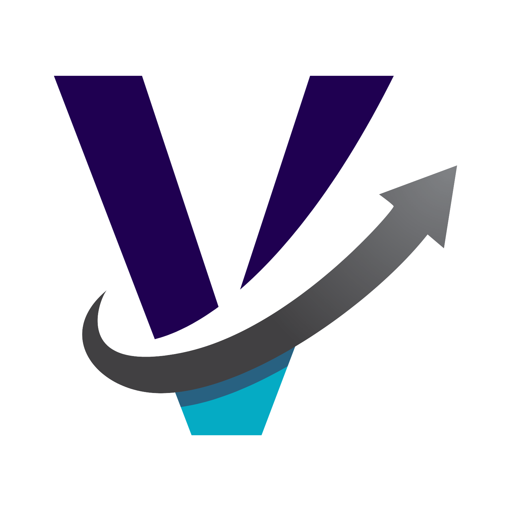
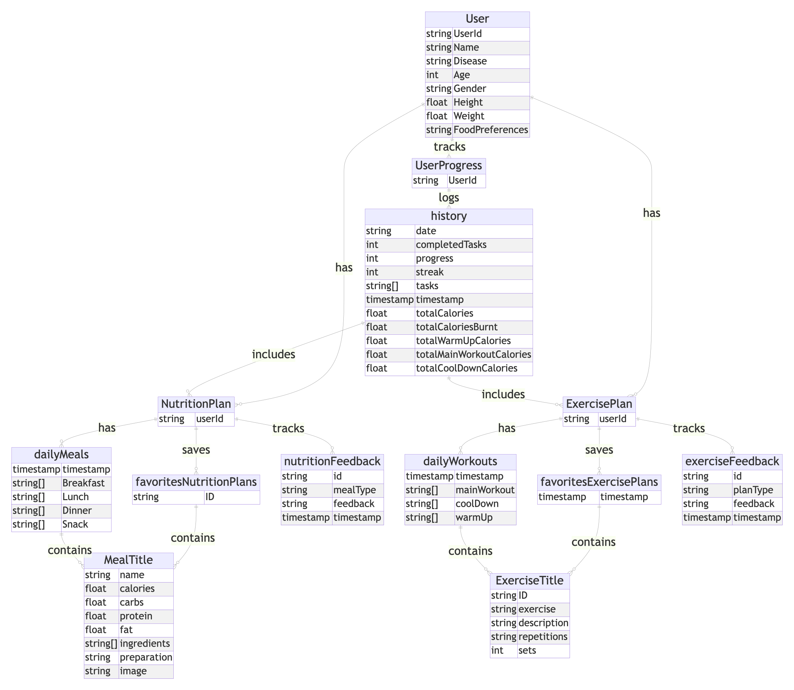
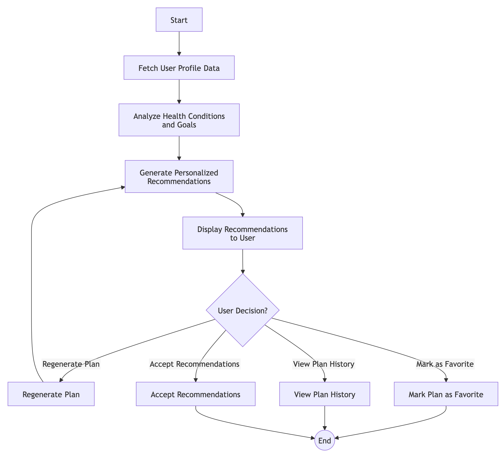

# 🥗 Verve  
**AI-Powered Nutrition & Fitness Advisor for Chronic Disease Management**



Verve is a smart, personalized mobile app built to help individuals manage chronic illnesses like diabetes, hypertension, and heart disease. 🌿💪  
It delivers intelligent nutrition and fitness recommendations powered by AI, tailored to your unique health data and goals.

---

## 🎯 Key Features
- 🥗 **Personalized Nutrition Plans** – AI-generated meal suggestions based on health conditions, dietary preferences, and restrictions.  
- 🏃 **Custom Exercise Routines** – Safe, adaptive workout plans aligned with fitness levels and medical needs.  
- 📈 **Daily Progress Tracking** – Visual feedback on how you're progressing each day.  
- 📱 **Seamless User Interface** – Built with Flutter for a smooth, accessible experience.  
- 🔐 **Secure Cloud Storage** – Uses Firebase to ensure user data is protected and available when needed.

---

## 🛠️ Tech Stack
- 📲 **Frontend:** Flutter  
- 🔥 **Backend & DB:** Firebase  
- 🤖 **AI Engine:** Gemini  

---

## 🏗️ System Architecture

The system follows a clean layered architecture to ensure modularity and scalability:

### 1️⃣ Presentation Layer  
- Cross-platform mobile app (iOS/Android)  
- Screens include: Home, Meal Plans, Exercise Plans, History, Favorites, Profile, and Feedback  

### 2️⃣ Application Layer  
- ⚙️ **AI Engine** generates personalized plans  
- 🧭 **Goal Tracker** monitors user achievements  
- 💬 **Feedback Handler** gathers and adapts to user inputs  

### 3️⃣ Data Access Layer  
- Communicates between server logic and database using secure APIs  

### 4️⃣ Database Layer  
- Stores all user data, plan history, and preferences securely via Firestore  


---

## 🗂️ Entity-Relationship Diagram  

A visual representation of how Verve manages relationships between user profiles, plans, and progress data.

#### 🔹 Entities Include:
- `User`: Personal & medical information  
- `NutritionPlan`: Generated meal schedules  
- `ExercisePlan`: Personalized workouts  
- `UserProgress`, `Favorites`, and `History`: Daily logs and tracking  



---

## 🔄 Activity Diagram – Requesting Plans

How Verve generates a custom plan:

1. 👤 **User Inputs** personal health info  
2. 📤 **Request Submitted**  
3. ✅ **System Validates Data**  
4. 🧠 **AI Engine Creates Plan**  
5. 📲 **Plan Displayed on App**



---

## 🚀 Getting Started

### ✅ Prerequisites  
- [Flutter SDK](https://flutter.dev/docs/get-started/install)  
- Firebase Project Setup  
- Python environment for AI components  

### ⚙️ Installation Steps
```bash
git clone https://github.com/your-repo/verve.git
cd verve_proto
flutter pub get
```

### 🔧 Firebase Setup
- Set up Firebase Project  
- Enable Firestore and Authentication  
- Add `google-services.json` (Android) and `GoogleService-Info.plist` (iOS)  

### ▶️ Run the App
```bash
flutter run
```

---

## 📌 Why Verve?

### 🩺 Targeted, Not Generic  
Verve isn’t just another fitness app. It’s purpose-built for people managing chronic conditions, using advanced AI to offer truly personalized guidance.

### 💡 Simple, Smart & Supportive  
- Auto-generated meal/exercise plans  
- Easy navigation and elegant UI  
- Helpful alerts and progress reminders  

---

## 🌱 What’s Next?
- 🤝 **Community Support & Health Expert Consultations**  
- ⌚ **Integration with Wearables** like Fitbit, Google Fit, etc.  

---

## 📸 Screenshots  


---

## 📬 Contact  
For feedback, support, or collaboration, reach out at: **vivek.kk224**

---

## 👨‍💻 Development Team  
- **Vivek K K**  https://github.com/Vivek-the-creator
- **Vishnupriyan P R**   https://github.com/vishnupriyanpr183207

---
